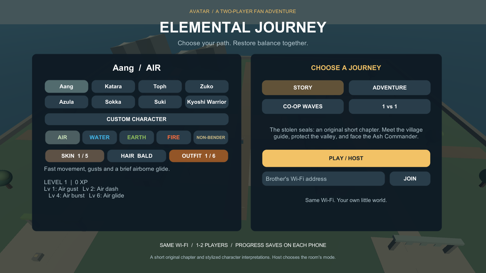
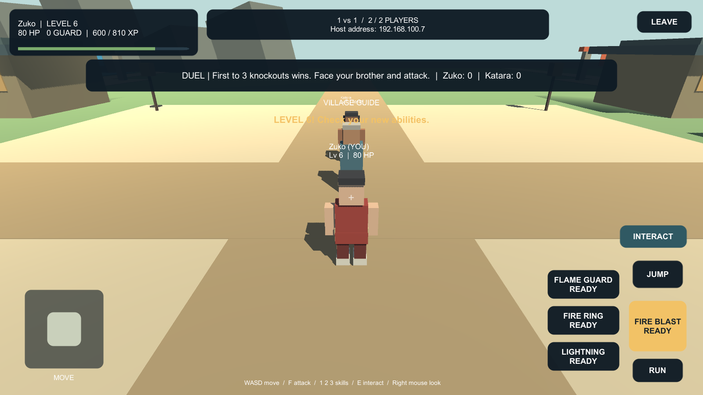

# Brothers Block: Elemental Journey

A small Avatar fan adventure for one or two players on Android. Both phones connect over the same Wi-Fi; one hosts and the other enters its address. Gameplay needs no paid server, subscription, Relay or Lobby service. Unity setup and package downloads need internet.

## Playable features

- Eight stylized character presets: Aang, Katara, Toph, Zuko, Azula, Sokka, Suki and a Kyoshi Warrior.
- A custom traveller with air, water, earth, fire or non-bender abilities, plus skin, hair and outfit choices.
- Four abilities per discipline, unlocking at levels 1, 2, 4 and 6. These include healing, armour, lightning, metal snare, blood bind and chi block.
- Story: a short original quest to protect the village and recover stolen seals.
- Adventure: clear three guarded shrines and recover their scrolls.
- Co-op Waves: fight growing waves, share XP and revive your brother.
- Duel: first to three knockouts wins. Friendly damage is enabled only here.
- Touch movement, camera drag, running, jumping, abilities and interaction.
- XP saved per discipline on each phone. Characters keep their own progress when joining another room.

This is a prototype with original procedural scenery and stylized character interpretations. Quest and wave state restart with a new room; only character choices and XP persist. It has no public internet matchmaking, host migration, vehicles or building interiors.

## Install and play

The updated build target is **Elemental Journey 0.2.0 (2)**:

`Builds/Android/ElementalJourney.apk`

The older `BrothersBlock.apk` is the 0.1.0 exploration prototype and lacks these features. Both players must install the same updated APK.

1. Transfer the APK to each phone, open it, and allow that file app to install it when Android prompts.
2. Connect both phones to the same Wi-Fi.
3. On the first phone, choose a character and journey, then tap **PLAY / HOST**. You can play solo except in Duel.
4. Read **Host address** near the top of the screen.
5. On the other phone, choose a character, enter that address and tap **JOIN**. The host chooses the room's mode.
6. Move with the left stick, drag the right side to look, hold RUN, and tap JUMP. Face an enemy and use the ability buttons.
7. Use INTERACT near the guide, a cleared shrine or a fallen brother. Follow the objective text and blue marker in Story.

On a computer: WASD/arrows move, right mouse drag looks around, Shift runs, Space jumps, F attacks, 1/2/3 use skills, and E interacts. Escape leaves the room.

The APK targets Android 8.0 or newer, ARM64/ARMv7 and OpenGL ES 3. It is a development build for private testing. Physical-phone compatibility, touch ergonomics and performance still need testing.

For USB installation, enable USB debugging and accept the computer prompt on the phone:

```powershell
adb devices
adb -s DEVICE_SERIAL install -r Builds/Android/ElementalJourney.apk
```

The game uses UDP 7777. Guest Wi-Fi can isolate devices; use a network that permits communication. If several host addresses appear, use the address in the host phone's Wi-Fi settings. No router port forwarding is needed. `127.0.0.1` is only for two processes on one computer.

Keep the host game open and foregrounded. Closing or suspending it can end the session. PC-hosted play may need Windows Firewall access on the private network; phone-to-phone play does not require the PC.

## Open and build in Unity

Use **Unity 6.6 (6000.6.0f1)** with Android Build Support, SDK/NDK Tools, OpenJDK and an active Editor licence. Visual Studio is not required. Open the folder containing Assets, Packages and ProjectSettings through Unity Hub.

Choose **Brothers Block > Open neighbourhood**, press Play, and choose PLAY / HOST. The world and UI are generated at runtime, so the scene looks sparse outside Play mode. The editor upgrades the existing player prefab with the combat component automatically.

Choose **Brothers Block > Build Android APK** to build `Builds/Android/ElementalJourney.apk`.

Netcode for GameObjects **2.13.2** is embedded in Packages; see [package source and licences](Packages/NETCODE-SOURCE.md). Its official Runtime and Editor code is unchanged. Unity 6.6 provides Transport 6.6.0 and the built-in UI/test packages. No purchased art assets are used.

Windows previously reported cache rename and executable overwrite errors in this OneDrive workspace. Builds are validated from an identical source copy in a local temporary folder. If those errors recur, copy the project to a regular local folder outside OneDrive and open that copy in Hub.

## Validation and development

See [build verification](Docs/VALIDATION.md) for the exact tested version, results, APK details and outstanding device checks.

Run these commands from this folder with Unity closed, one at a time:

```powershell
powershell -ExecutionPolicy Bypass -File Tools/Run-Unity.ps1 -Action Import
powershell -ExecutionPolicy Bypass -File Tools/Run-Unity.ps1 -Action EditTests
powershell -ExecutionPolicy Bypass -File Tools/Run-Unity.ps1 -Action PlayTests
powershell -ExecutionPolicy Bypass -File Tools/Run-Unity.ps1 -Action BuildDesktopTest
powershell -ExecutionPolicy Bypass -File Tools/Test-TwoPlayers.ps1
powershell -ExecutionPolicy Bypass -File Tools/Run-Unity.ps1 -Action BuildAndroid
```

Each command starts background processes and prints their IDs and log paths. Wait for completion before the next Unity command. The two-player probe exits automatically; inspect both result JSON files for `passed: true`. The execution-policy setting applies only to that PowerShell process.

`Tools/Test-LanRules.ps1` runs 24 engine-independent networking checks without Unity. Unity tests additionally cover progression, skill locks, combat, the story chain, guarded scrolls, touch movement and room reopening. The desktop probe covers movement and combat replication, different characters, a complete duel, shared XP and co-op friendly-fire prevention. Test probes do not save XP.

Before relying on the game, test on both real phones: host in both directions, move/look/run/jump and cast simultaneously, complete quests together, leave and rejoin, cancel a failed join, restart to check saved XP, and inspect frame rate and camera collision. Networking trusts player movement and local XP and is intended for private sibling play.





## Source layout

- `LanSession.cs`, `LanRules.cs`: networking and room admission.
- `PlayerMotor.cs`, `OwnerNetworkTransform.cs`, `FollowCamera.cs`: movement, synchronization and camera.
- `BendingRules.cs`, `BenderCombat.cs`: characters, abilities, progression and combat RPCs.
- `AdventureDirector.cs`: quests, enemies, waves, duels and shared world snapshots.
- `AvatarLook.cs`, `BendingEffect.cs`, `Neighbourhood.cs`: procedural visuals.
- `GameHud.cs`, `MoveStick.cs`, `LookPad.cs`, `HoldButton.cs`: menus and controls.
- `Assets/Editor/StarterProject.cs`: scene/prefab setup and build commands.
- `LanProbe.cs`: development-build multiplayer check and preview capture.

Generated caches, builds, logs and machine-specific certificate configuration are ignored by Git.
